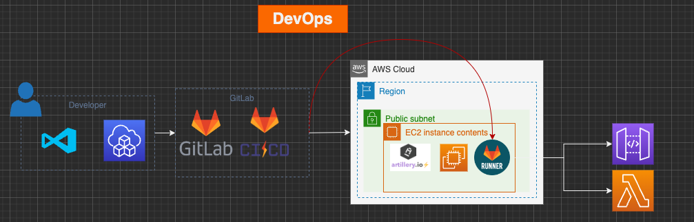

# Devops performance test using Artiller 

In this repository you will find below folders

- ✨devops✨ focus on implementing artillery performance test using Gitlab devops
- ✨developer✨ focus on using artillery on local dev machine with or without containers

